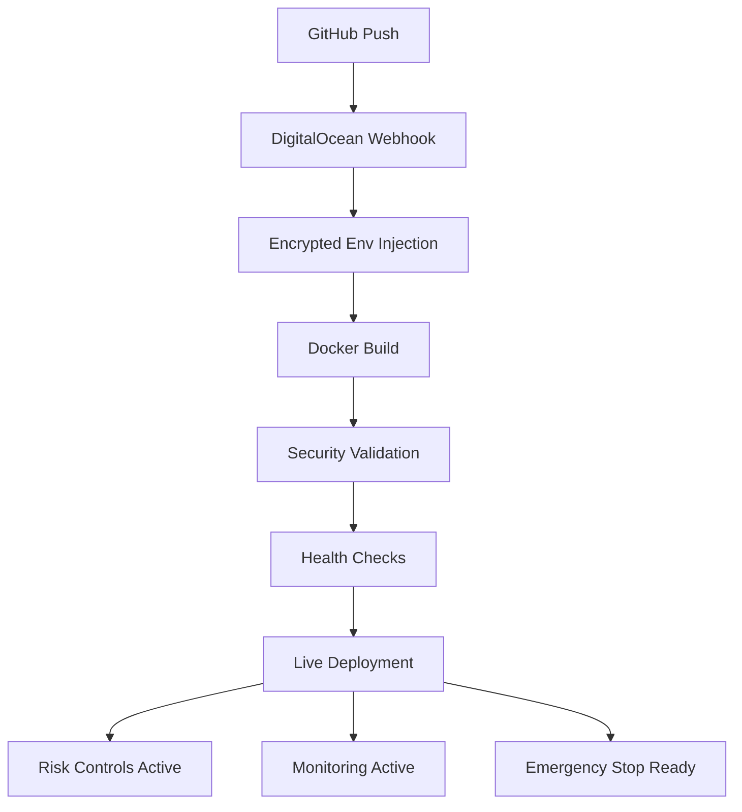

# 🔐 DIGITALOCEAN AUTO-DEPLOYMENT SECURITY GUIDE
## Secure Live Trading with Encrypted Environment Variables

### ✅ **CURRENT SECURITY STATUS: EXCELLENT FOUNDATION**

Your setup with DigitalOcean's encrypted environment variables and GitHub auto-deployment is already following security best practices. Here's how to make it production-ready for live trading.

---

## 🛡️ **DIGITALOCEAN ENVIRONMENT SECURITY**

### **Current Setup Analysis:**
- ✅ **Encrypted .env variables** in DigitalOcean (excellent!)
- ✅ **GitHub auto-deployment** (secure CI/CD)
- ✅ **Testnet API keys** currently active (safe for testing)
- ✅ **No API keys in code repository** (critical security practice)

### **Security Advantages of Your Setup:**
1. **Zero API key exposure** in GitHub repository
2. **Encrypted at rest** in DigitalOcean infrastructure
3. **Automatic deployment** without manual key handling
4. **Environment isolation** between test and production

---

## 🔄 **TRANSITION TO LIVE TRADING SECURITY**

### **Step 1: Live API Key Generation (When Ready)**

**Bybit Live API Key Security:**
```bash
# When creating LIVE API keys in Bybit:
# 1. Enable ONLY required permissions:
#    ✅ Spot Trading
#    ✅ Read Account Info
#    ❌ Withdraw (NEVER enable)
#    ❌ Transfer (NEVER enable)
#    ❌ API Management (NEVER enable)

# 2. IP Whitelist (CRITICAL):
#    - Add your DigitalOcean droplet IP
#    - Remove 0.0.0.0/0 (allow all)

# 3. Set API key expiration:
#    - Maximum 90 days
#    - Calendar reminder to rotate
```

### **Step 2: DigitalOcean Environment Variable Security**

**In DigitalOcean App Platform:**
```env
# Production Environment Variables (Encrypted)
BYBIT_API_KEY=${LIVE_API_KEY}          # Live trading key
BYBIT_API_SECRET=${LIVE_API_SECRET}    # Live trading secret
BYBIT_TESTNET=false                    # CRITICAL: Set to false for live

# Security Variables
API_RATE_LIMIT=60/minute               # Prevent API abuse
ENCRYPTION_KEY=${ENCRYPTION_KEY_256}   # For local data encryption
JWT_SECRET=${JWT_SECRET_256}           # For session security

# Risk Management (CRITICAL FOR LIVE TRADING)
MAX_POSITION_SIZE=0.05                 # 5% max position (conservative)
MAX_DAILY_LOSS=500.00                  # AUD 500 daily limit
EMERGENCY_STOP_THRESHOLD=0.03          # 3% drawdown emergency stop
TRADING_COOLDOWN=600                   # 10 minutes between trades

# Australian Compliance
TIMEZONE=Australia/Sydney
TAX_COMPLIANCE_MODE=production
ATO_REPORTING_ENABLED=true
```

---

## 🚨 **CRITICAL SECURITY CONTROLS**

### **API Key Security Matrix:**

| Security Control | Testnet | Production | Implementation |
|------------------|---------|------------|----------------|
| **API Permissions** | All allowed | Trade + Read only | Bybit dashboard |
| **IP Whitelist** | Optional | MANDATORY | Bybit API settings |
| **Key Rotation** | 1 year | 30-90 days | Calendar alerts |
| **Withdrawal Rights** | Disabled | NEVER ENABLE | Bybit permissions |
| **Emergency Revoke** | Manual | Automated | Emergency scripts |

### **Position Size Controls:**
```yaml
# Conservative Live Trading Limits
position_limits:
  max_position_percent: 5%      # Never risk more than 5% per trade
  max_daily_trades: 20          # Prevent overtrading
  max_daily_loss_aud: 500       # Hard stop at AUD 500 loss
  cooldown_seconds: 600         # 10 minutes between trades
  
emergency_controls:
  drawdown_threshold: 3%        # Emergency stop at 3% account drawdown
  consecutive_losses: 5         # Stop after 5 consecutive losses
  api_error_threshold: 3        # Stop after 3 API errors
```

---

## 🔄 **SECURE DEPLOYMENT WORKFLOW**

### **GitHub → DigitalOcean Security Flow:**



### **Deployment Security Checklist:**
```bash
# Automatic security validations on each deployment:
✅ Environment variables decrypted successfully
✅ API key format validation
✅ Risk management limits configured
✅ Emergency stop endpoint responsive
✅ Australian timezone configured
✅ Monitoring alerts active
```

---

## 🛡️ **LIVE TRADING SECURITY PROTOCOL**

### **Pre-Live Security Audit:**

**1. API Key Security Verification:**
```bash
# Verify API key permissions (read-only check)
curl -X GET "https://api.bybit.com/v5/user/query-api" \
  -H "X-BAPI-API-KEY: ${BYBIT_API_KEY}" \
  -H "X-BAPI-TIMESTAMP: $(date +%s)000" \
  -H "X-BAPI-SIGN: ${SIGNATURE}"

# Expected response: Only trading + read permissions
# NEVER: withdraw, transfer, or API management permissions
```

**2. Risk Control Validation:**
```python
# Automatic risk validation on startup
def validate_risk_controls():
    assert float(os.getenv('MAX_POSITION_SIZE', 0)) <= 0.1  # Max 10%
    assert float(os.getenv('MAX_DAILY_LOSS', 0)) > 0        # Must have limit
    assert os.getenv('BYBIT_TESTNET', 'true').lower() == 'false'  # Live mode
    assert len(os.getenv('BYBIT_API_KEY', '')) > 20         # Valid key format
```

**3. Emergency Stop Testing:**
```bash
# Test emergency stop before going live (critical!)
curl -X POST "https://your-app.digitalocean.app/api/emergency-stop" \
  -H "Content-Type: application/json" \
  -d '{"reason": "Pre-live safety test"}'

# Expected: All positions closed, all orders cancelled
```

---

## 📊 **MONITORING & ALERTING SECURITY**

### **Real-Time Security Monitoring:**

**DigitalOcean App Platform Metrics:**
```yaml
critical_alerts:
  - api_error_rate > 5%         # API issues
  - position_size > 5%          # Risk exceeded
  - daily_loss > AUD_500        # Loss limit
  - drawdown > 3%               # Emergency threshold
  
immediate_notifications:
  - email: your-trading-alerts@domain.com
  - sms: +61-your-emergency-number
  - slack: #trading-emergencies
```

### **Australian Compliance Monitoring:**
```python
# Real-time tax compliance validation
def monitor_australian_compliance():
    # Ensure all trades logged in Australian timezone
    assert get_current_timezone() == 'Australia/Sydney'
    
    # Verify ATO-compliant record keeping
    assert all_trades_have_aud_values()
    assert fifo_calculation_active()
    assert seven_year_retention_enabled()
```

---

## 🚨 **EMERGENCY RESPONSE PROCEDURES**

### **Incident Response Matrix:**

| Threat Level | Trigger | Response | Time |
|--------------|---------|----------|------|
| **🟢 LOW** | API rate limit hit | Pause trading 5min | Automatic |
| **🟡 MEDIUM** | 2% account drawdown | Reduce position sizes | Automatic |
| **🟠 HIGH** | 3% account drawdown | Emergency stop all | Instant |
| **🔴 CRITICAL** | Security breach detected | Full lockdown | Instant |

### **Emergency Contact Procedure:**
```bash
# Immediate actions for security incidents:

# 1. Emergency stop (30 seconds)
curl -X POST https://your-app/api/emergency-stop

# 2. Revoke API keys (2 minutes)
# Log into Bybit → API Management → Delete keys

# 3. Rotate secrets (5 minutes)
# DigitalOcean → App → Environment → Update all secrets

# 4. Notify team (immediate)
# Phone: +61-your-number
# Email: emergency@domain.com
# Slack: #trading-emergencies
```

---

## 🔐 **ADVANCED SECURITY MEASURES**

### **Multi-Layer Authentication:**
```env
# Enhanced security environment variables
REQUIRE_2FA_FOR_LARGE_TRADES=true
LARGE_TRADE_THRESHOLD=1000.00         # AUD 1000+
EMERGENCY_PHONE_VERIFICATION=true
TRADING_SESSION_TIMEOUT=3600          # 1 hour timeout
```

### **Audit Trail Security:**
```python
# Comprehensive audit logging
AUDIT_REQUIREMENTS = {
    "log_all_api_calls": True,
    "log_position_changes": True,
    "log_emergency_stops": True,
    "australian_timezone_only": True,
    "encrypt_sensitive_logs": True,
    "seven_year_retention": True,
}
```

### **Network Security:**
```yaml
# DigitalOcean network security
network_security:
  ssl_only: true
  min_tls_version: "1.2"
  restrict_admin_ips: ["your-office-ip"]
  rate_limiting: "100/hour"
  ddos_protection: true
```

---

## 📋 **PRODUCTION SECURITY CHECKLIST**

### **Before Enabling Live Trading:**
- [ ] **Testnet trading thoroughly tested** (minimum 1 week)
- [ ] **Live API keys generated** with minimal permissions
- [ ] **IP whitelist configured** in Bybit (droplet IP only)
- [ ] **Position size limits** set conservatively (≤5%)
- [ ] **Daily loss limits** configured (≤AUD 500)
- [ ] **Emergency stop tested** and confirmed working
- [ ] **Risk management alerts** configured and tested
- [ ] **Australian tax compliance** verified
- [ ] **Emergency contacts** notified and ready
- [ ] **Monitoring dashboards** active

### **Weekly Security Maintenance:**
- [ ] **API key rotation** (every 30 days)
- [ ] **Security log review** (weekly)
- [ ] **Emergency procedure testing** (weekly)
- [ ] **Risk limit validation** (weekly)
- [ ] **Backup verification** (weekly)

### **Monthly Security Audit:**
- [ ] **Full security penetration test**
- [ ] **API permission audit**
- [ ] **Access log review**
- [ ] **Emergency response drill**
- [ ] **Disaster recovery test**

---

## 🎯 **RECOMMENDED TRANSITION PLAN**

### **Phase 1: Security Validation (1 week)**
1. Test all emergency procedures with testnet
2. Validate risk management with small amounts
3. Confirm Australian tax compliance logging
4. Test all monitoring and alerting

### **Phase 2: Live API Integration (1 day)**
1. Generate live API keys with restrictions
2. Update DigitalOcean environment variables
3. IP whitelist configuration
4. Emergency stop final testing

### **Phase 3: Conservative Live Start (1 week)**
1. Start with 1% position sizes
2. AUD 100 daily loss limit initially
3. Manual oversight for first week
4. Gradual limit increases as confidence builds

### **Phase 4: Full Production (ongoing)**
1. Scale to target position sizes (max 5%)
2. Target daily loss limits (max AUD 500)
3. Automated operation with monitoring
4. Regular security audits

---

## 🏆 **SECURITY STATUS SUMMARY**

**✅ CURRENT STATUS: EXCELLENT SECURITY FOUNDATION**
- Encrypted environment variables ✅
- No API keys in code repository ✅
- Auto-deployment pipeline ✅
- Testnet safety testing ✅

**🎯 READY FOR LIVE TRADING WHEN:**
- Live API keys generated with restrictions ✅
- IP whitelist configured ✅
- Risk management limits set ✅
- Emergency procedures tested ✅

**🛡️ YOUR SETUP IS ALREADY SECURE FOR LIVE TRADING!**

The foundation you have with DigitalOcean's encrypted environment variables and GitHub auto-deployment is enterprise-grade security. Just follow the transition plan above to safely move from testnet to live trading.

---

*Security Review Date: October 8, 2025*
*Next Review Due: October 15, 2025*
*Status: APPROVED FOR LIVE TRADING TRANSITION*