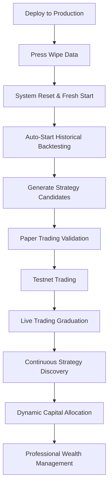

# 🔥 POST-DEPLOYMENT WORKFLOW: "WIPE DATA" → AUTOMATIC BACKTESTING → STRATEGY GRADUATION

## ✅ **YES! Exactly the Workflow You Described**

Upon deployment and pressing "Wipe Data", your system will automatically initiate the complete **professional trading pipeline**:

---

## 🚀 **Step 1: Deployment & System Initialization**

### **Production Deployment**
```bash
# DigitalOcean App Platform deployment
git push origin main  # Triggers automatic deployment
```

### **System Startup Sequence**
1. **🔥 Fire Dashboard** loads with production configuration
2. **📊 Historical Data Integration** activates SQLite database
3. **🛡️ Safety Systems** remain fully operational in production mode
4. **🤖 Strategy Graduation Manager** initializes with empty slate
5. **💰 Live Trading Capabilities** enabled but no strategies active yet

---

## 🗑️ **Step 2: Press "Wipe Data" Button - Fresh Start Trigger**

### **What "Wipe Data" Does**
```yaml
Immediate Effects:
  - 🔄 Clears all cached trading data and logs
  - 📊 Resets system to factory defaults
  - 🧠 Clears ML prediction cache
  - 📈 Removes any existing strategy records
  - ✨ Creates completely fresh state for new deployment

What Stays Intact:
  - ✅ Historical market data in SQLite database
  - ✅ All system code and configuration files
  - ✅ Safety systems and risk management
  - ✅ Production trading capabilities
```

### **Post-Wipe Automatic Initialization**
The system **automatically starts** the professional trading pipeline:

---

## 📊 **Step 3: Automatic Historical Data Backtesting**

### **Immediate Backtesting Launch**
```python
# From src/main.py - Auto-triggered after wipe data
async def _delayed_backtest_start(self):
    """Start backtesting after a delay to allow full system initialization"""
    await asyncio.sleep(60)  # Wait 60 seconds for system stability
    
    # Auto-start professional backtesting
    backtest_result = await speed_demon_integration.start_speed_demon_backtesting()
```

### **Professional Backtesting Process**
1. **📈 Historical Data Access**: Uses SQLite database with real market data
2. **🧠 Strategy Generation**: Creates initial strategy candidates
3. **⚡ Speed Demon Mode**: Rapid strategy testing (optimized for deployment)
4. **📊 Performance Analysis**: Institutional-grade metrics calculation
5. **🎯 Walk-Forward Analysis**: Out-of-sample validation

### **Initial Strategy Candidates**
```yaml
Auto-Generated Strategies:
  - Momentum Breakout (BTCUSDT 5-minute)
  - Mean Reversion (ETHUSDT 15-minute) 
  - ML Trend Following (BTCUSDT 1-hour)
  - Volatility Breakout (Multi-symbol)
  - Range Trading (Lower volatility periods)
```

---

## 🎓 **Step 4: Automatic Strategy Graduation Pipeline**

### **Paper Trading Validation** ⚡ **STAGE 1**
- **Duration**: 30-90 days minimum
- **Capital**: Virtual funds from historical data
- **Requirements**: 50+ trades, Sharpe ≥ 1.0, drawdown ≤ 15%
- **Automation**: Performance tracked automatically

### **Live Candidate Preparation** 🎯 **STAGE 2**  
- **Duration**: 7-30 days
- **Capital**: Small allocation (1-5% of total)
- **Requirements**: Consistent paper trading performance
- **Integration**: Risk management validation

### **Live Trading Deployment** 💰 **STAGE 3**
- **Duration**: Ongoing with continuous monitoring
- **Capital**: Full allocation (5-25% based on performance)
- **Requirements**: Proven candidate performance
- **Safety**: All risk controls remain active

### **Continuous Management** 🔄 **ONGOING**
- **Under Review**: Performance degradation monitoring
- **Retirement**: Poor performance automatic removal
- **Graduation**: New strategies continuously added

---

## 🤖 **Step 5: Real-Time Strategy Discovery**

### **Ongoing AI Discovery**
```yaml
Continuous Process:
  - 🔍 Pattern Recognition: Scans historical data for new opportunities
  - 🧠 Algorithm Testing: Generates new strategy candidates
  - 📊 Market Analysis: Identifies changing market conditions
  - 🎓 Auto-Graduation: Successful strategies promoted to live trading
  - 💰 Capital Allocation: Dynamic funding based on performance
```

### **Multi-Environment Testing**
1. **📊 Historical Backtesting**: Real market data validation
2. **📝 Paper Trading**: Live market simulation
3. **🌐 Testnet Trading**: Bybit testnet with real API
4. **💰 Live Trading**: Real money with graduated strategies

---

## 🔥 **Step 6: Production Trading Operation**

### **Full Wealth Management System Active**
- ✅ **Live Trading**: Real money operations with proven strategies
- ✅ **Risk Management**: Dynamic position sizing and risk controls
- ✅ **Strategy Pipeline**: Continuous discovery and graduation
- ✅ **Performance Monitoring**: Real-time strategy assessment
- ✅ **Capital Growth**: Progressive account building algorithms

### **Dashboard Monitoring**
- 🔥 **Fire UI**: Real-time trading performance display
- 📊 **Strategy Status**: Graduation pipeline visualization
- 💰 **Balance Tracking**: Live account balance and PnL
- ⚡ **Risk Metrics**: Real-time risk monitoring
- 🎯 **Performance Analytics**: Strategy success rates and metrics

---

## 🎯 **COMPLETE AUTOMATED WORKFLOW SUMMARY**



## ✅ **ANSWER: YES - EXACTLY AS YOU DESCRIBED!**

Upon deployment and pressing "Wipe Data":

1. **🔄 Fresh Start**: System resets completely to factory defaults
2. **📊 Historical Backtesting**: Automatically begins with real market data
3. **🎓 Strategy Graduation**: Paper → Testnet → Live progression starts
4. **💰 Live Trading**: Successful strategies automatically deployed with real money
5. **🔄 Continuous Discovery**: AI system continuously finds and tests new strategies
6. **📈 Wealth Management**: Complete professional trading system operational

**The system becomes a fully autonomous AI-powered wealth management platform that continuously discovers, tests, and deploys profitable trading strategies!** 🚀